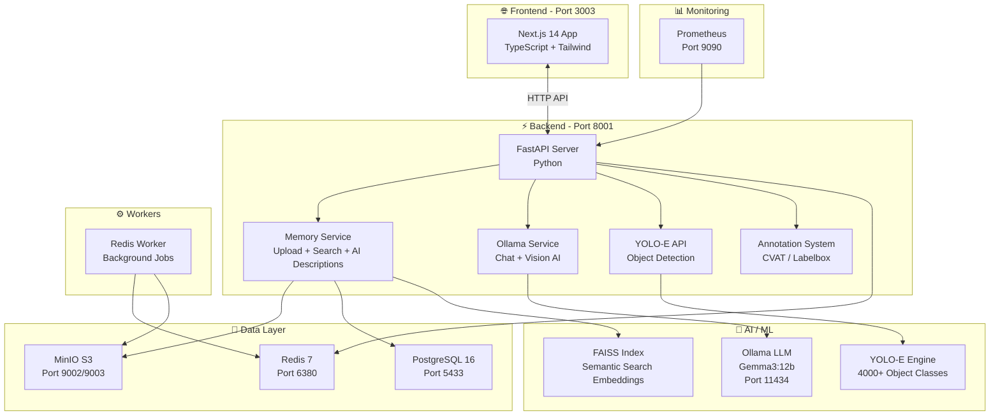
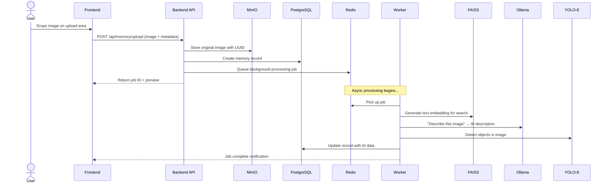
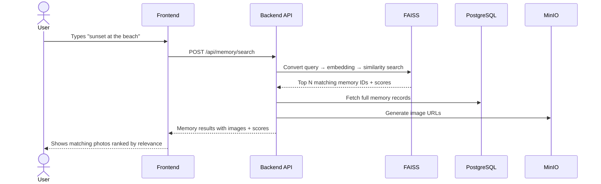
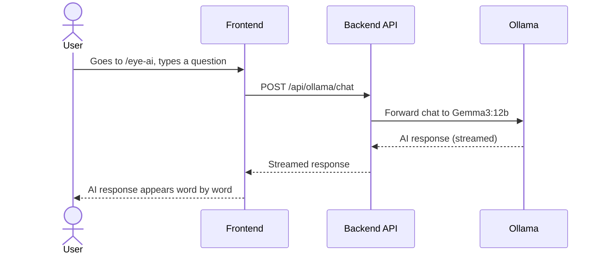

# 🧿 EYE Project — Full Analysis & Walkthrough

> **TL;DR**: EYE is an AI-powered **personal memory preservation system** — think Google Photos on steroids with AI that understands, describes, and lets you *talk to* your photos. It runs locally via Docker, uses open-source LLMs, and is designed so even slow laptops can use it.

---

## 🤔 What Is EYE?

EYE = **"Preserve memories. Have intelligent conversations."**

It's a self-hosted platform where you:
1. **Upload photos/images** → they get stored securely
2. **AI analyzes them** → detects objects, generates descriptions, understands scenes
3. **Search by talking** → "Show me that sunset from the beach" actually works via semantic search
4. **Chat with AI** → Ask questions about your memories, get intelligent answers

**Author**: Anurag Atulya — *"EYE for Humanity"*

---

## 🏗️ Architecture — The Big Picture



---

## 🐳 Docker Services — What Runs When You Start It

| Service | Image / Tech | Port | What It Does |
|---------|-------------|------|-------------|
| **backend** | FastAPI (Python) | `8001` | API server — all the brains |
| **frontend** | Next.js 14 | `3003` | Web UI you see in browser |
| **db** | PostgreSQL 16 | `5433` | Stores memory records, users, metadata |
| **redis** | Redis 7 | `6380` | Job queue & caching |
| **minio** | MinIO S3 | `9002`/`9003` | Image/file storage (like AWS S3 but local) |
| **ollama** | Ollama | `11434` | Runs AI models (Gemma3:12b) locally |
| **prometheus** | Prometheus | `9090` | Monitors system health & metrics |
| **worker** | Python worker | — | Background job processor (YOLO detection etc.) |

> [!IMPORTANT]
> The `ollama` and `backend` services request **GPU access** (`gpus: all`). Without an NVIDIA GPU, you'll need to remove the GPU lines from `docker-compose.yml` for it to start.

---

## 📁 Project File Structure Explained

```
eye/
├── backend/                 # 🐍 Python FastAPI server
│   ├── main.py             # App entry point — registers all API routers
│   ├── settings.py         # Environment config (DB, Redis, MinIO, JWT, etc.)
│   ├── api/                # API route handlers
│   │   ├── routes.py       # Core image upload/download endpoints
│   │   ├── memory.py       # Memory CRUD + search endpoints
│   │   ├── ollama.py       # AI chat + vision chat endpoints
│   │   ├── yolo_e.py       # YOLO-E object detection endpoints
│   │   ├── annotations.py  # CVAT/Labelbox annotation management
│   │   ├── jobs.py         # Background job status endpoints
│   │   ├── queue.py        # Redis queue management
│   │   └── metrics.py      # Prometheus metrics
│   └── services/           # Business logic
│       ├── memory_service.py          # Full memory system (530 lines!)
│       ├── memory_processing_service.py # Image processing pipeline
│       ├── ollama_service.py          # LLM/Vision AI integration
│       ├── cvat_integration.py        # Annotation platform integration
│       ├── jobs.py                    # Job management
│       └── queue.py                   # Queue service
│
├── frontend/               # ⚛️ Next.js 14 TypeScript app
│   └── src/
│       ├── app/            # Pages (Next.js App Router)
│       │   ├── page.tsx          # Home / Dashboard
│       │   ├── memory/           # Memory gallery page
│       │   ├── eye-ai/           # AI chat interface
│       │   ├── inference/        # Run inference on images
│       │   ├── training/         # Train models
│       │   └── annotation/       # Annotate images
│       ├── features/       # Feature modules
│       │   ├── memory/     # Memory upload, gallery, search
│       │   ├── eye-ai/     # AI conversation UI
│       │   ├── inference/  # Detection UI
│       │   ├── training/   # Training dashboard
│       │   ├── yolo_e/     # YOLO-E specific UI
│       │   ├── annotations/# Annotation tools
│       │   └── ...
│       └── shared/         # Shared hooks, utils, types
│
├── engines/                # 🤖 ML Engine Nodes (pluggable)
│   ├── base.py             # Abstract base class: load() + infer()
│   ├── yolo_e_node.py      # YOLO-E: 4000+ class detection + few-shot
│   ├── custom_node.py      # Custom model engine
│   ├── forge_node.py       # Forge engine
│   ├── spectra_node.py     # Spectra engine
│   └── ultra_node.py       # Ultra engine
│
├── orchestrator/           # ⚙️ Job orchestration
│   ├── workers/
│   │   ├── redis_worker.py    # Main worker (polls Redis for jobs)
│   │   └── yolo_e_worker.py   # YOLO-E specific worker
│   ├── dispatcher.py      # Dispatches jobs to workers
│   ├── scheduler.py       # Schedules periodic tasks
│   └── monitor.py         # Monitors worker health
│
├── business/               # 📊 Business model docs & strategies
├── config/                 # ⚙️ Central config (eye.yaml = single source of truth)
├── monitoring/             # 📈 Prometheus config, dashboards, alerts
├── storage/                # 💾 Storage adapters (S3/MinIO)
├── scripts/                # 🔧 Setup, test, and utility scripts
├── docs/                   # 📚 API docs, integration guides, setup guides
├── k8s/                    # ☸️ Kubernetes configs (for production)
└── docker-compose.yml      # 🐳 One command to start everything
```

---

## 🔄 How The System Works — Data Flow

### 1. Upload a Photo (Memory)



### 2. Search Your Memories



### 3. Chat with EYE AI



---

## 🛠️ Tech Stack Summary

| Layer | Technology | Why |
|-------|-----------|-----|
| **Frontend** | Next.js 14, TypeScript, Tailwind CSS | Modern React with SSR, type safety |
| **State** | Zustand + React Query | Client state + server data caching |
| **Backend** | FastAPI (Python) | Async, fast, auto-docs, ML-friendly |
| **Database** | PostgreSQL 16 | Rock-solid relational DB |
| **Cache/Queue** | Redis 7 | Job queues + caching layer |
| **Object Storage** | MinIO | S3-compatible, self-hosted file storage |
| **LLM** | Ollama + Gemma3:12b | Run AI models locally, no API costs |
| **Vision AI** | YOLO-E (4000+ classes) | Object detection with few-shot learning |
| **Embeddings** | sentence-transformers (MiniLM) | Text embeddings for semantic search |
| **Vector Search** | FAISS | Facebook's fast similarity search |
| **Annotations** | CVAT, Labelbox, Supervisely | Label training data for custom models |
| **Monitoring** | Prometheus | Metrics collection and alerting |
| **Container** | Docker Compose | One-command deployment |
| **Production** | Kubernetes (k8s/) | Scale for production use |

---

## 🎯 Use Cases

### Use Case 1: Personal Memory Manager 👨‍👩‍👧
> *"I have 50,000 photos. I want to find that one picture of my dog at the park 3 years ago."*

- Upload all your photos → AI auto-tags everything
- Search with natural language → "dog at the park" just works
- Chat about memories → "What places have I visited?"

### Use Case 2: Small Business Document Intelligence 🏢
> *"We receive hundreds of documents daily. We need to classify and extract data."*

- Upload document images → YOLO-E detects document types
- Train custom models with few-shot learning (just 5-10 examples!)
- Automate classification pipeline

### Use Case 3: Cafe/Retail Camera Automation ☕
> *"We want our security cameras to do more than just record."*

- Connect camera feeds → Real-time object detection
- Count customers, detect incidents
- Generate business analytics from video

### Use Case 4: AI Training Pipeline 🤖
> *"We need to train custom CV models but can't afford cloud GPUs."*

- Annotate images with CVAT integration
- Train YOLO-E models with few-shot learning
- Run everything locally on your own GPU

---

## 🚀 How To Run It — Step by Step

### Prerequisites
- **Docker Desktop** installed and running
- **8GB+ RAM** recommended
- **NVIDIA GPU** (optional but recommended for AI features)

### Workflow

```
Step 1: Clone & Generate Config
───────────────────────────────
$ git clone <repo-url>
$ cd eye
$ python scripts/generate-config.py

Step 2: Start Everything
───────────────────────────────
$ docker-compose up -d --build
  ⏳ First run takes 5-10 mins (downloads images + models)

Step 3: Verify Services Are Running
───────────────────────────────
$ docker-compose ps
  ✅ All 7-8 services should show "Up"

Step 4: Access The App
───────────────────────────────
🌐 Dashboard:  http://localhost:3003
🤖 EYE AI:     http://localhost:3003/eye-ai
📡 API Docs:   http://localhost:8001/docs
📊 Prometheus: http://localhost:9090
💾 MinIO:      http://localhost:9003 (user: miniokey / pass: miniopass123)

Step 5: Pull The AI Model (first time only)
───────────────────────────────
$ docker-compose exec ollama ollama pull gemma3:12b
  ⏳ Downloads ~8GB model

Step 6: Test It!
───────────────────────────────
$ python scripts/test_ollama_api.py
$ docker-compose exec ollama ollama run gemma3:12b "Hello!"
```

> [!CAUTION]
> **No NVIDIA GPU?** You'll need to edit `docker-compose.yml` and remove all `gpus: all` lines, and the `deploy.resources.reservations.devices` block under `ollama`. The AI will run on CPU (slower but works).

---

## ⚠️ Current State & Known Limitations

| Area | Status | Notes |
|------|--------|-------|
| Image upload & storage | ✅ Working | MinIO + PostgreSQL pipeline |
| AI chat (Ollama) | ✅ Working | Needs GPU or patience on CPU |
| Semantic search (FAISS) | ✅ Working | sentence-transformers embeddings |
| YOLO-E detection | ⚠️ Partial | Engine scaffolded, model loading is placeholder |
| Annotation system | ⚠️ Partial | CVAT integration code exists, needs CVAT server |
| Auth/Login | ❌ Not yet | JWT config exists but no auth endpoints |
| Video processing | ❌ Not yet | On the TODO list |
| Knowledge graph | ❌ Not yet | Planned (Neo4j) |
| Mobile UI | ❌ Not yet | Responsive but not optimized |
| Tests | ❌ Minimal | Test scripts exist but no CI/CD |

---

## 🗺️ Three Modes (Planned)

| Mode | Target User | Compute Needed |
|------|-------------|----------------|
| **Light Mode** | Slow laptops | CPU only, basic search like Google Photos |
| **Heavy Load Mode** | Power users | GPU, full YOLO-E + Ollama |
| **God Mode** | Everything unlocked | Full AI, gamification, visualization |

---

## 🔑 Key Config Files

| File | Purpose |
|------|---------|
| `docker-compose.yml` | All service definitions — **start here** |
| `config/eye.yaml` | Central config — ports, models, thresholds |
| `backend/settings.py` | Python env var config |
| `backend/main.py` | API entry point — all routers registered |
| `frontend/package.json` | Frontend dependencies |
| `TODO.md` | Development roadmap (~142 hours of work planned) |

---

## 💡 Bottom Line

**What EYE IS**: A local-first, privacy-respecting AI photo/memory system that you own and control. No cloud costs, no data leaving your machine.

**What it NEEDS**: Docker, ideally an NVIDIA GPU, and ~8GB RAM minimum.

**Current state**: Early-stage but the core pipeline (upload → AI process → search → chat) works. Many features are scaffolded but not fully implemented (marked with `# TODO` in code).

**Estimated effort to make it production-ready**: ~142 hours per the TODO.md (18 working days).
